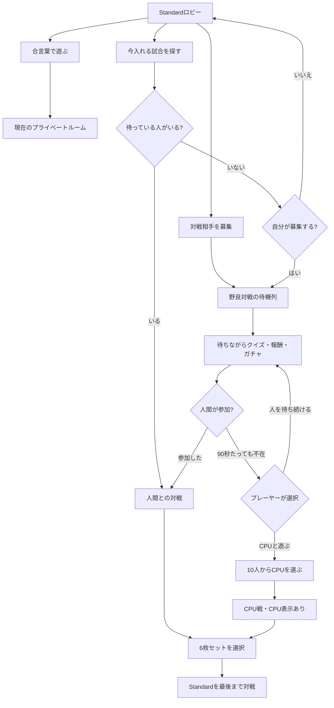

# 合言葉不要マッチングとCPUフォールバック構想

状態: 人間同士の第1段階と同意制CPUフォールバックを統合ブランチへ実装済み。本番DB・Edge・公開版には未適用で、実DB競合試験と公開完走は未検証。

## プロダクト方針

既存の招待対戦を残し、別の導線として野良対戦を追加する。

- `合言葉で遊ぶ`: 家族・友人向けの現在のプライベートルーム。
- `対戦相手を募集`: 公開Standardルームを作り、ほかのプレーヤーを待つ。
- `今入れる試合を探す`: 参加可能な公開ルームのうち、最も長く待っている相手へ安全に参加する。見つからない場合は、自分が募集側になるか確認する。
- 野良対戦では合言葉を要求・表示しない。
- 初期版は条件を分けないStandardキューを1本だけ用意する。地域・強さ・ルールなどの条件は、利用者が増えてから追加する。人数の少ない段階で条件を増やすと、待機列が分散して相手が見つかりにくくなる。

募集を待つ間は、既存の待機中クイズ・報酬・ガチャ・スキルカード進行を続けられる。相手が見つかった場合は対戦を優先するが、回答や結果演出の途中ではなく、現在の1問が終わるなど自然な区切りで切り替える。

## CPU表示と同意

CPUを本物の人間だと偽装しない。最初の1回は驚きがあっても、後から分かるとゲームへの信頼を損ね、勝敗記録の意味も曖昧になる。友人同士でゲームが広がったときにも説明しづらい。

ゲームらしさを残しながら、次のように正直に見せる。

- 90秒経過時に、操作を遮りすぎない形で `このまま人を待つ` / `CPUと対戦する` を表示する。
- 180秒経過時に一度だけ再案内し、自動では開始しない。
- CPUを選んだ場合は、固定キャラクター名で通常の対戦開始導線へ進み、ルームとメンバー欄に常時 `CPU` と表示する。
- CPUを選ぶまでは人間の募集を続ける。CPU選択と、直前に入ってきた人間との競合はサーバー側で一度だけ決着させ、対戦相手が二重に決まらないようにする。
- CPU戦の成績は対人戦と分けて記録する。通常の練習・クイズ進行報酬は得られてもよいが、将来の対人レートや対人勝率には黙って混ぜない。

CPU案内はクイズの回答中に重ねず、問題と問題の間に出す。`このまま人を待つ` を選んだ場合は、そのまま待機ゲームを再開する。

## 固定CPUロスター

CPUを単純な「弱・中・強」にせず、10人の固定キャラクターとして用意する。全員が人間と同じルールで戦い、強さは数値補正ではなく、判断の癖、読みの深さ、ミスの種類、スキル選択から生まれる。

| キャラクター | 対戦中の癖 | 得意 | 苦手・起こしやすいミス | お気に入りスキル候補 |
| --- | --- | --- | --- | --- |
| うっかりユズ | 思いついた手を明るく即決する | 小さなエリアをテンポよく作る | 終盤の色不足を見落とす、良いスキル機会を忘れる | 色拾い・乱、ひとふくらみ |
| せっかちレン | 大きな陣地を早く取りにいく | 序盤の面積争い | 形を広げすぎ、後から塗りづらくする | エリア拡張、四色解放 |
| 見習いミナト | 難しい技を試したがる | 意外性のある仕掛け | 対象選択や使う順番がまだ甘い | エリア二分、持ち色変更 |
| 読み違いコハル | 相手の色を予想して妨害する | 妨害をためらわない | 公開履歴からの色予測を外しやすい | 色封じ・乱、持ち色汚染・乱 |
| 慎重派アオイ | 安全な小手を積み重ねる | 自滅しにくい盤面作り | 好機でも攻めず、面積で遅れやすい | 色借り、ひとふくらみ |
| 勝負師カイ | ランダム効果も含めて勝負する | 劣勢からの逆転 | 有利なときにも賭けへ出て流れを失う | 四色解放、二重封じ・乱 |
| 仕掛け屋ツバサ | 盤面の形を大きく動かす | エリア形状の操作 | 形に夢中になり、色と残り手数を軽視する | 半マスシフト、三層断層 |
| 観察役シオン | 相手の公開行動をよく覚える | 持ち色の確率予測と妨害 | 読みに時間を使い、素直な面積勝負が遅い | 色封じ、持ち色汚染 |
| カード博士レイ | スキル同士のつながりを重視する | 使用タイミングと組み合わせ | カードを封じられると通常手がやや単調 | エリア二分、追封 |
| 四色のクロガネ | 盤面・色・妨害を総合して判断する | 終盤管理と相手の癖への適応 | 大胆な賭けは少なく、奇策には反応が遅れることがある | 持ち色変更、長封 |

名前・口調は仮称。重要なのは、各CPUに「勝ちやすさ」ではなく攻略できる個性があること。プレーヤーは対戦前に、性格、得意、苦手、お気に入りスキルを読んで相手を選べる。

### 選択画面

- 90秒後に `CPUと対戦する` を選ぶと、10人の対戦相手一覧を開く。
- 初期版の各カードには名前、短い一言、得意、苦手、お気に入りスキルを表示する。顔・立ち絵は見た目機能の後続段階で追加する。
- 強さの星・レベル・Easy/Hardは表示しない。
- 初期版は必ず10人全員を一度に表示する。最近選んだ相手の並べ替えは利用状況を見て後から追加する。
- キャラクター別に対戦数、勝敗、初勝利日を記録する。「全員に1勝」のような収集目標へつなげられる。
- 対戦開始・スキル使用・予想外の一手・勝敗時に、短い固定台詞を出す。生成チャットにはせず、安全に確認できる台詞集を使う。

### 思考パラメーター

実装内部では単一の `difficulty` を持たず、少なくとも次の軸をキャラクターごとに設定する。

- `lookaheadDepth`: 何手先まで盤面を比較するか。
- `legalChoiceNoise`: 合法手の中で、評価が少し低い手を選ぶ頻度。
- `skillWindowRecall`: 有効なスキル使用機会を思い出す確率。
- `skillTargetAccuracy`: スキル対象の選び方の上手さ。
- `hiddenInference`: 公開履歴から相手の非公開情報を推測する精度。
- `riskTolerance`: ランダム効果や大きなエリアへ賭ける傾向。
- `endgameDiscipline`: 終盤の残り色・残り面積・手番を重視する度合い。
- `adaptationRate`: 対戦中に相手の傾向へ方針を寄せる速さ。
- `favoriteSkillBias`: お気に入りスキルを持ち込み、使いたがる度合い。

「うっかり」は不正な操作やわざとの通信失敗では表現しない。サーバーが認める合法手の候補から、戦略評価の低い手を一定確率で選ぶことで表現する。これならCPUの個性が、ゲームの不具合に見えない。

強い推理型CPUも、人間のprivate stateを直接読まない。人間にも見える盤面、公開された行動履歴、使用済みスキルだけから確率を更新する。推理が当たることはあっても、答えを知っている状態にはしない。

各CPUは、色操作2枚・エリア操作2枚・相手妨害2枚という同じ6枚制約を守る。お気に入りを中心とする複数の固定候補から、対戦開始時にサーバーがロードアウトを決める。レア度による露骨な能力差ではなく、性格との組み合わせで手触りを変える。

## プレーヤー導線

## サーバー設計

### ルーム属性

`public.fcg_rooms` を追加変更する。

- `access_mode`: `private_code`、`public_queue`、`cpu`。
- `opponent_kind`: `human` または `cpu`。

現在のスキーマでは `code_hash` が必須なので、野良・CPUルームにも互換性のため内部用ランダムハッシュを持たせてよい。ただし野良対戦では生の合言葉をクライアントへ返さず、画面にも表示しない。

### 非公開マッチングチケット

`fcg_private.standard_matchmaking_tickets` を追加し、次を保持する。

- チケットIDと認証済みユーザーID。
- 表示名の開始時スナップショットとプロフィールrevision。
- 状態: `searching`、`claimed`、`cancelled`、`expired`。
- 作成・heartbeat・期限切れ・確定の各時刻。
- 確定したルームID。
- 1ユーザーにつき有効なチケットは1件だけ、という一意制約。

参加可能なルーム一覧をブラウザーに公開しない。クライアントには、狭い権限のRPCまたはEdge応答を通じて自分の検索結果だけを返す。これにより、ユーザーID・活動状況・参加用識別子の漏えいを防ぐ。

### 操作

`standard-game-action` に次の冪等な操作を追加する。狭いRPCを用意してEdgeから呼ぶ形でもよい。

- `matchmake-recruit`: 呼び出した本人の募集チケットを作成・更新。
- `matchmake-find`: 最も長く待つ適合チケットを確保。見つからない場合は、黙って募集側へ移さず `NONE_AVAILABLE` を返す。
- `matchmake-status`: 本人のチケット状態、待ち時間、確定ルームIDだけを返す。
- `matchmake-cancel`: 本人の `searching` チケットだけを取消。
- `matchmake-accept-cpu`: 選択した `cpuCharacterId` を検証し、まだ検索中のチケットをそのCPUとのルーム1件へ変換。

マッチングは1回のデータベーストランザクションで実行する。ユーザー単位のadvisory lockと `FOR UPDATE SKIP LOCKED`、または同等の原子的な確保処理を使う。同じトランザクション内でルーム作成、A/B席の登録、該当チケットの確定を行い、安全な再試行では同じルームを返す。

必須条件:

- 同じ匿名アカウント同士を対戦させない。
- 1ユーザーを複数の進行中Standardルームへ入れない。
- 1枚のチケットから人間戦とCPU戦の両方を作らない。
- 短いheartbeat TTLを使い、切断された検索を期限切れにする。
- 募集・検索・取消・CPU承諾をレート制限する。
- 既存の「ルーム参加者だけがルームを読める」「本人だけが自分のprivate viewを読める」境界を維持する。

### CPUの身元と操作

CPU席Bにはサーバー所有の予約済みIDを使い、偽の匿名ブラウザーセッションは作らない。現在のメンバー・プロフィール表はAuthへの外部キーを必須にしていないため、予約UUIDとサーバー管理プロフィールを追加的に使える。ただし、ブラウザー向けポリシーと各サーバー関数で「ログイン不能なCPU」であることを明示的に扱う。

CPUの判断はサーバー側で行い、人間と同じ権威的Standardエンジンと行動検証を通す。思考ロジックに渡すのは公開対戦状態とCPU席自身のprivate stateだけで、人間側の非公開パレット・ロードアウトは渡さない。初期版では次に絞る。

- 合法手だけを選ぶ。
- 小さいエリアの完成や、合法な低リスク色を優先する。
- 人間と同じ6枚を持ち、共通合法手列挙を通して性格に応じたスキルも使う。全19スキルは自動CPU対戦で拒否なく完走することを確認する。
- 人間の通信を偽装するためではなく、読みやすさのためだけに短い思考時間を置く。
- ブラウザー切断後も、再読込時に権威的ルーム状態から再開する。

10人の設定はクライアント任せにせず、サーバー側のversion付きレジストリを正本にする。判断に乱数を使う場合は、ルームID・手番version・キャラクターIDから専用seedを作り、同じ操作の再試行で別の手を選ばないようにする。

## クライアント変更

プライベート導線を置き換えず、ロビーを2グループに分ける。

1. `友だちと遊ぶ`: 合言葉ルーム作成・合言葉参加。
2. `だれかと遊ぶ`: 対戦相手を募集・今入れる試合を探す。

野良検索中はチケットIDを保存し、再読込時に復帰する。待ち時間、取消、既存の待機中遊びを表示する。相手が確定したらチケットを消し、既存Standardクライアントのルーム接続状態へ引き継ぐ。

画面文言は明示する。

- 検索中: `対戦相手を探しています`。
- 人間が確定: `対戦相手が見つかりました`。
- 明示的にCPUを承諾: `CPUと対戦します`。
- 取消後: `募集を取り消しました`。
- 期限切れ: `接続が切れたため募集を終了しました`。

## 実装の分割

### 第1段階: 人間同士の野良マッチング

- [実装済み・未適用] 非公開チケット、検索receipt、heartbeat TTL、取消、レート制限を含む追加migration。
- [実装済み・未公開] `対戦相手を募集` / `今入れる試合を探す`、再読込用ID保持、待機表示、取消UI。
- [実装済み・未公開] 確定後は合言葉を表示せず、既存の6枚セット・対戦同期へ引き継ぐ。
- [検証済み] 静的境界、クライアント再送、実ブラウザの募集/取消/検索/セットアップ遷移。
- [未検証] 実DBでの2人・10人同時確保、取消競合、二端末完走。本番適用の承認後に実施する。
- CPUはまだ入れない。

### 第2段階: 同意制CPUフォールバック

- [実装済み・未適用] 90秒案内、見送った場合の180秒再案内、自動開始をしない明示同意UI。
- [実装済み・未適用] チケット行ロックによる、人間参加とCPU承諾の原子的な一方だけの決着。
- [実装済み・未適用] ルームごとのログイン不能CPUメンバー/プロフィール、削除時のCPUプロフィール清掃、サーバー側思考。
- [実装済み・未公開] 10人のversion付き固定ロスター、各6枚ロードアウト、性格別パラメーター、固定台詞、得意/苦手/お気に入りを読む選択画面。
- [実装済み・未適用] 決定的CPU action IDで1手ずつ別commitし、公開状態とCPU自身のprivate stateだけから判断する処理。
- [実装済み・未適用] 対人戦とCPU戦を分けた集計、キャラクター別対戦数/勝敗/初勝利日、共有トロフィーと人間だけの報酬。
- [検証済み] ロジック/静的境界75件、実ブラウザの90秒案内・10人選択・CPU明示・1CPU手。全体635件実行時の2件のタイミング揺れは個別再実行でCPU 2/2、既存接触演出43/43合格。
- [未検証] migrationの実DB構文、人間参加との実同時競合、CPU戦の公開完走/再読込。CPU専用再戦はfail-closedで後続実装。

### 第3段階: 友人テスト後の調整

- 不要な個人情報を集めず、待ち時間の中央値・p90、取消率、CPU承諾率、復帰失敗、完走率を計測。
- CPU案内の時間と難易度を調整。
- 実際の同時利用人数が支えられる場合だけ、強さ・条件指定を追加。

## 公開ゲート

ローカル・staging試験で次を証明する。

- 同時に検索した2人から、別々の席を持つルームがちょうど1件だけ作られる。
- 10件の同時確保でも、同じチケット・ユーザーを二重確保しない。
- 取消・期限切れ後に突然マッチングしない。
- 人間参加とCPU承諾が競合しても、相手は必ず一方だけになる。
- 再読込で検索中・確定済み・対戦中・終了済みへ復帰できる。
- CPUは人間のprivate stateを読めず、不正な手を送れない。
- 10人それぞれが設定どおりの選択傾向を示し、同じ乱数seedでは判断を再現できる。
- 「うっかり」行動も常に合法で、通信エラーや操作失敗としては現れない。
- 各CPUの6枚セットが、色・エリア・妨害を2枚ずつ含む。
- 合言葉ルームが従来どおり動く。
- 人間戦・CPU戦ともに最後まで完走し、精算は一度だけで、新しい対戦を開始できる。

公開完了の条件は従来どおり、公開URLで別々の2端末から「募集／探す」を行い、1試合完走、再読込、新しい対戦まで確認すること。CPUフォールバックは加えて、実時間90秒の待機、明示的な承諾、CPU表示、最後までの完走を確認する。

## 推奨初期値

まず人間同士の野良マッチングを `野良対戦（試験中）` として公開し、同時実行・再読込の安全性を確認した直後に10人選択式のCPUフォールバックを加える。初期値は90秒後の選択式とし、CPUへの無断切替は行わない。CPUは一列の難易度ではなく、「この相手の癖を攻略したい」と思える固定キャラクターとして育てる。
